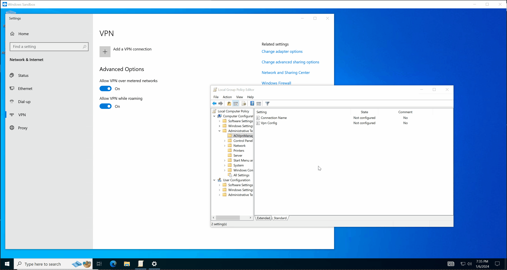

#  Always On Vpn Manager for Group Policy

An open-source application for deploying Always On VPN via Group Policy.

## Features
- **No** user action needed
- Fastest and easiest way to deploy your Always On VPN
- Free and open-source
- **No** Telemetry

## Download

### Group Policy update processor

Group Policy update processor should be installed on user's computer. This application will be looking for updates in group policy and apply them.

- [x64 (msi)](https://github.com/rinrab/aovpn-manager/releases/latest/download/AOVpnManager-win-x64.msi)
- [x86 (msi)](https://github.com/rinrab/aovpn-manager/releases/latest/download/AOVpnManager-win-x86.msi)
- [ARM (msi)](https://github.com/rinrab/aovpn-manager/releases/latest/download/AOVpnManager-win-arm64.msi)

### Policy Templates

Install Policy Templates on your server to manage your Always On VPN Connection.

- [Policy Templates (admx)](https://github.com/rinrab/aovpn-manager/releases/latest/download/PolicyTemplates.zip)

### Latest unstable build

> [!WARNING]
> These builds are unstable and may contain bugs. They created from the latest pushed commit.
>
> - [AOVpnManager x64 (msi)](https://nightly.link/rinrab/aovpn-manager/workflows/build/master/AOVpnManager-win-x64.zip)
> - [Policy Templates (admx)](https://nightly.link/rinrab/aovpn-manager/workflows/build/master/Policy%20Templates.zip)

## Demo

